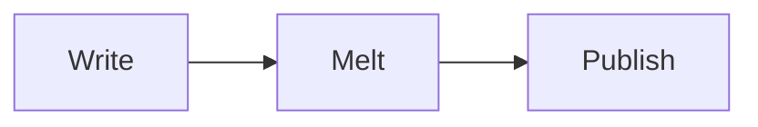

# Welcome to Vellumi ✨

A **melt-as-you-type** Markdown editor — syntax dissolves into typography while you write. Try typing `# ` on the next line to make a heading, or press `/` for the command menu.

## Things worth trying

- **⌘/** Source mode — read or edit the raw Markdown any time (front matter included)
- **⇧⌘P** Quick Open · **⇧⌘0** Projects · **⌥⌘1** Outline · **⌥⌘2** File tree
- **⌘,** Settings has typography (font, line height, line width), typewriter mode and focus mode
- Pasted images are saved automatically into an `assets/` folder beside your document
- `:smile:` → 😄, and Tab moves between table cells

## Code and diagrams

```python
def melt(markdown):
    return "typography"  # syntax highlighting works out of the box
```



| Action | Shortcut |
| ------ | -------- |
| Bold | ⌘B |
| Link | ⌘K |
| Headings | ⌘1–6 |

> Close this window whenever you're ready to start writing. This document is unsaved and leaves no trace.
